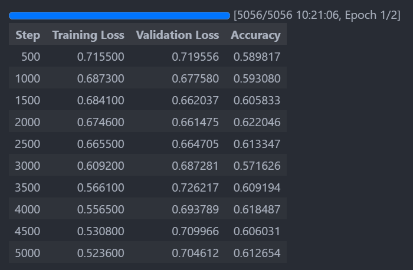
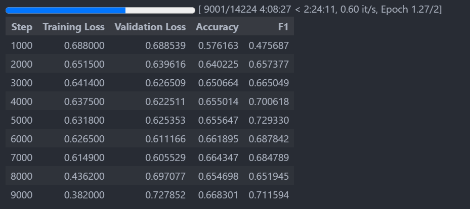

# MBTI Classifier - A Feasibility Study

Classifying someone's MBTI type based on their text data.

- [MBTI Classifier - A Feasibility Study](#mbti-classifier---a-feasibility-study)
  - [Data Preparation](#data-preparation)
    - [Data curation](#data-curation)
    - [Data summary](#data-summary)
    - [Pre-processing](#pre-processing)
    - [Baseline score](#baseline-score)
  - [Machine Learning Approach](#machine-learning-approach)
    - [Previous work](#previous-work)
    - [My own attempt](#my-own-attempt)
  - [Large Language Models Approach](#large-language-models-approach)
    - [Get started](#get-started)
    - [Reducing GPU memory usage](#reducing-gpu-memory-usage)
    - [Fine tuning LLM](#fine-tuning-llm)
    - [Adding system prompt](#adding-system-prompt)
    - [Other dimensions of MBTI types](#other-dimensions-of-mbti-types)
    - [Re-processing data](#re-processing-data)
  - [Treating Imbalanced Data](#treating-imbalanced-data)
    - [Overview](#overview)
    - [Under-sampling the majority class](#under-sampling-the-majority-class)
    - [Synthetic Minority Over-sampling Technique](#synthetic-minority-over-sampling-technique)
    - [Class weight balancing](#class-weight-balancing)
  - [Thoughs and Future Work](#thoughs-and-future-work)
    - [Thoughts](#thoughts)
    - [Future work](#future-work)
  - [References](#references)


## Data Preparation

### Data curation 

I have created a custom dataset for this project and this dataset is available on 

The raw data was uploaded to [Zenodo](https://zenodo.org/records/1482951) by Dylan Storey. 
It was obtained using Google Big Query from Reddit with users who have self-identified their MBTI type. 
To download the raw data, you can use the following command,

```bash
./setup.sh
```

which will also create some of the temporary directories for the data processing.

I have cleaned the data including 
- lowercasing all the text
- removing all URLs 
- removing posts with non-English characters
- removing Reddit links like `r/abcd` and `u/abcd`
- removing all special characters except for `?` and `!`
- removing posts with less than 20 characters and more than 3000 characters. 

Detailed cleaning steps can be found in [clean_data.py](./preprocessing/clean_data.py)


After cleaning, I found some discrenpencies in the data. 
- some authors have multiple MBTI types. 
- some posts are identical by the same author

I removed all the duplicates described above. 
In addition, there was a user who has posted a lot of inapproperiate content.
This resulted him being banned by many moderators with a lot of automated banning message. 
I removed all the posts by this user to clean up the data.

This is done in [remove_duplicate.py](./preprocessing/remove_duplicate.py)

### Data summary

The final dataset consist of 13M rows and 3 columns with 11,773 unique authors. 
Each row contains one post with the author name and author's MBTI tag. 
I also provided a dataset with unique authors and their MBTI types.

At this point, this can be considered as a foundation dataset for the MBTI classification. You can find the dataset on [Kaggle](https://www.kaggle.com/datasets/minhaozhang1/reddit-mbti-dataset).

### Pre-processing 

Due to the nature of chat messages, the length of each message varies a lot. 
A very short message may not contain enough information to predict someone's personality. 
Thus, I decided to combine shorter messages into longer ones with a minimum length of 700 characters (including spaces) and maximum 1000 characters. 
Detailed steps can be found in [combine_short_text.py](./preprocessing/combine_short_text.py)

Though counting by characters are an effective way to create a balanced dataset, it might introduce some problem when we try to use LLMs' tokenization. 
As the tokenization is roughly based on words, the number of tokens in a sentence might not be the same as the number of characters. 
Thus, I decided to further process the data into a narrower range of word length. 
Detailed steps can be found in [evenout_word_length.py](./preprocessing/evenout_word_length.py) and the dataset can be found on [huggingface](https://huggingface.co/datasets/minhaozhang/mbti). 

### Baseline score

As we have obtained our final dataset, we can explore the distribution of the MBTI types in the dataset. 
We can use a majority classifier to see the baseline performance. 
You can find more information in [eda.ipynb](./preprocessing/eda.ipynb)

| Type | Accuracy | F1 Score |
| ---- | -------- | -------- |
| E-I  | 0.78858  | 0.88179  |
| N-S  | 0.92603  | 0.96160  |
| F-T  | 0.53863  | 0.70014  |
| J-P  | 0.59189  | 0.74363  |


## Machine Learning Approach 

### Previous work

There has been efforts to predict someone's personality based on text data. 
The most extreme example would be the series of quesitons from [16personalities.com](https://www.16personalities.com/) which will classify someone's MBTI type based on the answers. 
However, using a more natural conversation data, the task becomes more challenging. One such attempt is documented by Ryan et al. (2023) where they used a dataset from Kaggle to predict someone's MBTI type based on the text data. 

They used a traditional machine learning approach with a TF-IDF vectorizer and several classifiers like CatBoost with a technique called SMOTE to balance the data. 
Their work, though demonstrating the improvement by introducing SMOTE, did not resulted in a good performance. 
A simple way to tell is that for the binary classification for I/E, their best F1 score is 0.8389. 
However, based on their I/E distribution of 6676/1999, we can obtain the F1 score of 0.86978 when using a dummy model like a majority classifier. 
This means that their model is not better than a simple majority classifier.

### My own attempt 

I followed the same approach as Ryan et al. (2023) with my own cleaned and much larger dataset. 
I used mostly the same data pre-processing strategy as them, but I used several gradient boosting classifier such as CatBoost, XGBoost, and LightGBM. 
Though my data distribution is different from theirs, the result did not outperform theirs. 
My best F1 score is slightly lower than the majority classifier. 
The detailed training and evaluation can be found in [train_model.ipynb](./ml/train_model.ipynb)

These unseccessful results might be due to the nature of the MBTI classification or it might be the limitation of the traditional machine learning approach. 
Thus, I will try to employ the large language models to see if we can improve the performance. 

<table>
  <tr>
    <th>Type</th>
    <th>Metric</th>
    <th>Baseline</th>
    <th>XGBoost</th>
    <th>CatBoost</th>
    <th>LightGBM</th>
  </tr>
  <tr>
    <td rowspan="2">E-I</td>
    <td>Accuracy</td>
    <td>0.7886</td>
    <td>0.7891</td>
    <td>0.7889</td>
    <td>0.7890</td>
  </tr>
  <tr>
    <td>F1 Score</td>
    <td>0.8818</td>
    <td>0.8819</td>
    <td>0.8820</td>
    <td>0.8820</td>
  </tr>
  <tr>
    <td rowspan="2">N-S</td>
    <td>Accuracy</td>
    <td>0.9260</td>
    <td>0.9263</td>
    <td>0.9261</td>
    <td>0.9262</td>
  </tr>
  <tr>
    <td>F1 Score</td>
    <td>0.9616</td>
    <td>0.9617</td>
    <td>0.9616</td>
    <td>0.9617</td>
  </tr>
  <tr>
    <td rowspan="2">F-T</td>
    <td>Accuracy</td>
    <td>0.5386</td>
    <td>0.6284</td>
    <td>0.6248</td>
    <td>0.6234</td>
  </tr>
  <tr>
    <td>F1 Score</td>
    <td>0.7001</td>
    <td>0.6794</td>
    <td>0.6794</td>
    <td>0.6781</td>
  </tr>
  <tr>
    <td rowspan="2">J-P</td>
    <td>Accuracy</td>
    <td>0.5919</td>
    <td>0.6162</td>
    <td>0.6116</td>
    <td>0.6116</td>
  </tr>
  <tr>
    <td>F1 Score</td>
    <td>0.7436</td>
    <td>0.3248</td>
    <td>0.2596</td>
    <td>0.2619</td>
  </tr>
</table>

## Large Language Models Approach

### Get started

I will be using the recently released [Phi-3](https://azure.microsoft.com/en-us/blog/introducing-phi-3-redefining-whats-possible-with-slms/) model from Microsoft. 
This model recently opened up its fine tuning on Azure AI Studio, but I decided to use the Huggingface's [transformers](https://huggingface.co/transformers/) library to fine tune the model as it is more flexible. 

To get started, I simply followed the turotial on [sequence classification](https://huggingface.co/docs/transformers/en/tasks/sequence_classification). 
This tutorial works through the fine tuning of a model using Google Bert. 
It also provides a structure on how the code should look like when fine tuning a model. 
Different from the tutorial, I will be using the Phi-3 model instead of Bert which is a much newer model. 
This introduced some computation power requirement. 
Even with the smallest [Phi-3-mini-4k-instruct](https://huggingface.co/microsoft/Phi-3-mini-4k-instruct) model, it is just infeasible to fine tune on my PC. 
Thus, I used a cloud service with one A100 GPU to fine tune the model. 

### Reducing GPU memory usage

Though the machine with A100 GPU is much better than my PC, I still need to use some strategies to decrease the vRAM usage. 
Using a tool like [Model Memory Estimator](https://huggingface.co/spaces/hf-accelerate/model-memory-usage) from Huggingface, the model with the `Adam` optimizer and dtype `float32` will require 57GB of peak vRAM. 
Combining with the space for the data, it will exceed the 80GB vRAM of the single A100 GPU. 
Thus, certain strategies need to be employed to reduce the vRAM usage. 

All the strategies are learned from [transformers](https://huggingface.co/docs/transformers/perf_train_gpu_one) tutorials. 

| Method/tool                            | Methods I Employed                                |
| -------------------------------------- | ------------------------------------------------- |
| Batch size choice                      | Yes, to reduce vRAM usage                         |
| Gradient accumulation                  | Yes, to effectively increase the batch size       |
| Gradient checkpointing                 | No, decrease training speed by 20%                |
| Mixed precision training               | Yes, used `tf32` to increse training speed        |
| torch_empty_cache_steps                | No, decrease training speed by 10%                |
| Optimizer choice                       | Yes, used `adamw_bnb_8bit` to reduce memory usage |
| Data preloading                        | Yes, by default                                   |
| DeepSpeed Zero                         | No, could not set up enviornment                  |
| torch.compile                          | No, could not set up enviornment                  |
| Parameter-Efficient Fine Tuning (PEFT) | No, could not set up enviornment                  |

One thing interesting is that when I tried to use `bf16` dtype to reduce a bit more memory, the model's loss will be `nan`. 
I found a post with the exact problem I have but with a different model on [Huggingface Forum](https://discuss.huggingface.co/t/training-loss-0-0-validation-loss-nan/27950). 
Thus, I checked the model card but it seems like it is trained using `bf16` dtype by the [config.json](https://huggingface.co/microsoft/Phi-3-mini-4k-instruct/blob/main/config.json#L31). 
When I checked the pulled model file, it appears to be the same thing. 
I don't have an answer for this right now and anything could help. 

### Fine tuning LLM 

Following the tutorial which is about sentiment analysis, I modified the code to fit the MBTI classification task. 
As the MBTI can be thought as 4 binary classification tasks, I decided to approach this problem by treating it as 4 binary classification tasks instead of a 16-class classification task.
To start, I only tried to classify the J-P type as it is somewhat balanced but skewed a little bit. 
Using a 1% subset of the train split from the dataset, I was able to start the fine tuning of the model. 
In the beginning, it seems like the model is learning something.



Our model's accuracy achieved a better score than the majority classifier. 
However, it might just because the randomness of the data. 
Thus, I optimzed my code a bit (I realized my configuration was wrong and I was not using `tf32` to train the model) and used a larger dataset to fine tune the model.
This time, I used 10% of the train split and the model did not return a good result.


It seems like the fine-tuned model did learn to classify the J-P type.
However, in comparison with the [model baseline](#baseline-score), the model did not outperform the majority classifier.
This means that the model learned to predict everything to be the majority class.
When I realized this, I paused the training and trying to figure out what went wrong.  

### Adding system prompt

At this point, I realize that it might be quite hard for the LLM to notice the pattern among each MBTI type. 
This is much harder than the sentiment analysis task as the sentiment is much simpler. 
Thus, I decided to add a semi-system prompt to the input.
For every text, I added 
```text
You are an MBTI expert trying to identify using the text below which personality they are. 
You are only predicting Judging-Perceiving (J-P) for this task. Predict 0 for J and 1 for P.
Learn the personality not the proportion of data. Here are the text: 
```
before the text.
I was hoping that this will give the model a hint on what to look for.
Sadly, this did not improve the model's performance.


### Other dimensions of MBTI types 

At this point, I am not sure if the LLM can learn the pattern of the MBTI types. 
Thus, I decided to try to classify the other dimensions of the MBTI types. 
I proceeded with the Feeling-Thinking (F-T) type as it is the most balanced type. 
To start, I did not add the system prompt to the input. 

Using a 5% subset of the train split, I was able to start the fine tuning of the model.



It seems like my model achieved a better score in accuracy but a worse score is F1. 
Notice that the both accuracy and F1 score droppped at the 8000 steps. 
This is when it started training on the same piece of data but for another epoch. 
When it reaches the 9000 steps, the model's training loss is extremely low and validation loss is much 
This is a clear indication of overfitting. 
This suggest that I should only train my model with one epoch as the model is already overfitting the second I introduced the data again.

I trained the model on other dimensions as well, but the result is quite similar. 

### Re-processing data 

In the original data preparation, I removed all punctuations except for `?` and `!`.
I also lowered all cases to make them easier for the word2vec model to learn. 
In addition, my data in the beginning have about 200 words in each post. 
This might not be enough for the LLMs to learn the pattern of speech. 
Thus, I increased the number of words in each post to 400 while the overal samples decreased. 
I re-processed the data as [re_process_data.ipynb](./preprocessing/re_process_data.ipynb) and fine-tuned the model again.
Despite the changes, the model did not perform better than the majority classifier.

## Treating Imbalanced Data 

### Overview

As the data is imbalanced, it is normal for the model to predict everything to be the majority class.
Though LLMs are powerful, they are not immune to this problem.
To treat this, there are several methods that can be employed. 
- Over-sampling the minority class / Under-sampling the majority class
- SMOTE (Synthetic Minority Over-sampling Technique)
- Class weight balancing

### Under-sampling the majority class

As I discovered in previous section, the model overfit immediately when I introduced the data again.
I believe that over-sampling the minority class will make the model overfit even faster. 
Thus, I decided against using over-sampling and only use under-sampling.
As I have a lot of data, I can afford to under-sample the majority class. 
A simple way to do this is to randomly sample the majority class to the size of the minority class.

To start, I started with the J-P type as it is somewhat imbalanced but not too skewed. 
Using a subset of the train split, I splitted out another validation set. 
Then, I under-sampled the majority class to the size of the minority class. 

However, this did not improve the model's performance.
The training loss is different which signify the data is different, but the accuracy and F1 score are still the same as the majority classifier.
This maybe my naive implementation of under-sampling or it might be the nature of the MBTI classification. 

### Synthetic Minority Over-sampling Technique

SMOTE is a technique that generates synthetic samples for the minority class. 
It is also available in the `imbalanced-learn` library. 
There was a discussion [here](https://discuss.huggingface.co/t/how-to-apply-smote-to-a-dataset/27876), which uses the `imbalanced-learn` library to apply SMOTE to the dataset with a custom dataloader. 
However, based on my research on SMOTE and the task, I believe it is not suitable for generating synthetic samples for text data. 
Though Ryan et al. (2023) did use SMOTE in their work and they did show SMOTE improving the performance, their performance is still not better than the majority classifier. 
This resulted me thinking there might be a better way to treat the imbalanced data.

### Class weight balancing

I tried out one method mentioned in a forum [post](https://discuss.huggingface.co/t/how-can-i-use-class-weights-when-training/1067). 
The solution mentioned is quite simple and basically just scales the loss of the minority class by the ratio of the majority class to the minority class. 
As I am using the J-P dimension which is a 60-40 split, I just set the weight to be opposite of the proportion. 

However, this did not improve the model's performance. 
At the beggining of the training, the training loss shows me that it is trying to learn some pattern among the text, but it quickly turned into predicting everything to be the majority class.
At this point, I have run out of ideas to try on this project. 

## Thoughs and Future Work 

### Thoughts 

The MBTI classification based on text data is indeed challenging. 
It is unlike sentiment analysis where the sentiment is mostly quite clear in the text especially there are so many keywords we can try to look for. 
The MBTI classification task is much more subtle and it is hard to tell the personality of someone just by reading their text.
You have to analyze the context and habbit of speech and itention of the speaker to actaully predict this properly. 
This might still be quite challenging for the LLMs to learn.

### Future work 

There are places where I can improve on this project.
1. Use a better and longer datast. 
  In this project, each post is either about 200 or 400 words long in order to have a meaningfully large dataset. 
  If I combine the shorter text to even longer ones, the number of samples will decrease dramatically. 
  Addtionally, many of the long posts are by few authors which might introduce some bias. 
  Hence, a better dataset with longer posts and more samples is needed.
2. Use a better LLM model.
  I am using the Phi-3 model which is a quite new model. 
  It is good at logical inference and mathematically reasoning. 
  It has 3.8B parameters and 4k token context. 
  In comparison with other models, phi-3-mini-4k-instruct is quite a small model.
  Some SOTA models, at the moment I am writing this, like Llama3.1 can go upto 405B parameters with 128k token context. 
  These models will undoubtly extract more information from the text and might perform better on this task. 
  Sadly, due to the limitation of my computation power, I cannot try fine tuning these models. 
3. Use a better fine tuning strategy.
  I am using the `AutoModelForSequenceClassification` from `trasformers` from the tutorial on Huggingface.
  It is a good start point, but it might not be the best strategy for this task.
  Using torch with custom training loop might be a better strategy as it allows more flexibility. 
4. Use a better data pre-processing strategy.
  The data pre-processing strategy I used is quite simple and naive. 
  Though many of them are quite common in the NLP community, they might not be the best for this task. 
  Using a more advanced data pre-processing strategy might improve the model's performance.
  However, these might require some domain knowledge from phychology and linguistics. 


## References

Ryan, Gregorius, Pricillia Katarina, and Derwin Suhartono. 2023. "MBTI Personality Prediction Using Machine Learning and SMOTE for Balancing Data Based on Statement Sentences" Information 14, no. 4: 217. https://doi.org/10.3390/info14040217