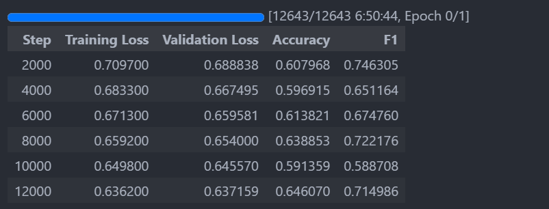
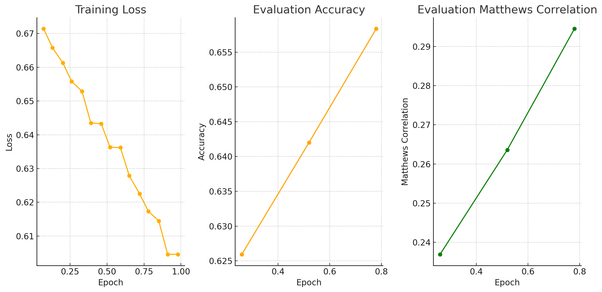

# Fine-Tuning Large Language Models for MBTI Classification Using Text Data

Classifying someone's MBTI type based on their text data.

<!-- 此文章有[中文版本](./README_ZH.md)。 -->

- [Fine-Tuning Large Language Models for MBTI Classification Using Text Data](#fine-tuning-large-language-models-for-mbti-classification-using-text-data)
  - [Try it out](#try-it-out)
  - [Data Preparation](#data-preparation)
    - [Data Curation](#data-curation)
    - [Data Summary](#data-summary)
    - [Pre-processing](#pre-processing)
    - [Baseline Score](#baseline-score)
  - [Choice of Evaluation Metric](#choice-of-evaluation-metric)
  - [Machine Learning Approach](#machine-learning-approach)
    - [Previous Work](#previous-work)
    - [Same Approach on my Dataset](#same-approach-on-my-dataset)
  - [Large Language Models Approach](#large-language-models-approach)
    - [Getting Started](#getting-started)
    - [Reducing GPU Memory Usage](#reducing-gpu-memory-usage)
    - [Fine-Tuning the LLM](#fine-tuning-the-llm)
    - [Adding a System Prompt](#adding-a-system-prompt)
    - [Other MBTI Dimensions](#other-mbti-dimensions)
    - [Re-processing the Data](#re-processing-the-data)
  - [Treating Imbalanced Data](#treating-imbalanced-data)
    - [Overview](#overview)
    - [Under-sampling the Majority Class](#under-sampling-the-majority-class)
    - [Synthetic Minority Over-sampling Technique (SMOTE)](#synthetic-minority-over-sampling-technique-smote)
    - [Class Weight Balancing](#class-weight-balancing)
  - [Thoughts and Future Work](#thoughts-and-future-work)
    - [Thoughts](#thoughts)
    - [Future Work](#future-work)
  - [References](#references)

## Try it out 

Create a virtual environment and install the required packages:

```bash
conda create -n mbti python=3.12.4
conda activate mbti
```

If you plan to try machine learning models, you can install the required packages under the `ml` directory:

```bash
pip install -r ml/requirements.txt
```

Then, execute the following command to tokenize and apply word2vec on the input:

```bash
python tokenize_data.py
python train_word2vec.py
python apply_word2vec.py
python train_test_split_for_ml.py
```

Then you can just run the [train_model.ipynb](./ml/train_model.ipynb) notebook.

---

If you plan to fine-tune a large language model, you can install the required packages under the `llm` directory:

```bash
pip install -r llm/requirements.txt
```

Then, you just need to check out several tuning notebook under `llm` and follow the instructions. 

Note, you will need one or more GPU. Out of the box, the training parameters are set up to use an A100 GPU with 80GB of vRAM. With this setup, you will probably need about 100 hours of compute to complete the training and evaluation process. So if you want to train all 4 dimensions, you will need about 400 hours. 


## Data Preparation

### Data Curation 

For this project, I curated a custom dataset that is publicly accessible. The raw data, initially uploaded to [Zenodo](https://zenodo.org/records/1482951) by Dylan Storey, was collected from Reddit using Google Big Query. It consists of posts from users who have self-identified their MBTI type. To download the raw data, run the following command:

```bash
./setup.sh
```

This command also sets up the necessary temporary directories for data processing.

The data underwent thorough cleaning, including the following steps:
- Converting all text to lowercase.
- Removing URLs.
- Excluding posts with non-English characters.
- Stripping Reddit-specific links like `r/abcd` and `u/abcd`.
- Removing special characters except `?` and `!`.
- Filtering out posts with fewer than 20 characters or more than 3,000 characters.

For a detailed breakdown of the cleaning process, refer to [clean_data.py](./preprocessing/clean_data.py).

During the cleaning, I identified several discrepancies:
- Some authors were linked to multiple MBTI types.
- Some posts were duplicated by the same author.

To resolve these issues, I removed all duplicates and excluded posts from a user who had posted inappropriate content, resulting in their ban by several moderators. All posts from this user were removed to maintain data integrity. These steps are implemented in [remove_duplicate.py](./preprocessing/remove_duplicate.py).

### Data Summary

The final dataset comprises 13 million rows and 3 columns, representing 11,773 unique authors. Each row contains a single post, along with the author's name and MBTI type. Additionally, a separate dataset with unique authors and their MBTI types is provided.

This dataset serves as a key resource for MBTI classification and is available for download on [Kaggle](https://www.kaggle.com/datasets/minhaozhang1/reddit-mbti-dataset).

### Pre-processing 

Due to the nature of chat messages, their lengths vary significantly. Very short messages may lack sufficient information for accurate personality prediction. To address this, I combined shorter messages to ensure a minimum length of 700 characters (including spaces) and a maximum of 1,000 characters. The detailed steps are provided in [combine_short_text.py](./preprocessing/combine_short_text.py).

Although using character count helps create a balanced dataset, it may introduce challenges when using LLMs, which tokenize based on words rather than characters. To mitigate this, I further processed the data to achieve a narrower range of word lengths. The steps are detailed in [evenout_word_length.py](./preprocessing/evenout_word_length.py), and the dataset can be accessed on [Hugging Face](https://huggingface.co/datasets/minhaozhang/mbti).

### Baseline Score

With the final dataset prepared, we can explore the distribution of MBTI types within it. A majority classifier can be used to establish a baseline performance. Further details are available in [eda.ipynb](./preprocessing/eda.ipynb).

| Type | Accuracy | F1 Score | Balanced Accuracy | Matthews Correlation Coefficient |
| ---- | -------- | -------- | ----------------- | -------------------------------- |
| E-I  | 0.78858  | 0.88179  | 0.5               | 0                                |
| N-S  | 0.92603  | 0.96160  | 0.5               | 0                                |
| F-T  | 0.53863  | 0.70014  | 0.5               | 0                                |
| J-P  | 0.59189  | 0.74363  | 0.5               | 0                                |


## Choice of Evaluation Metric

There are several metrics that can be used to evaluate the performance of a classification model. In the case of binary classification, there are many options to choose from, but accuracy and F-1 score are the most obvious options. There are more metrics available on the [Evaluation of Binary Classifiers](https://en.wikipedia.org/wiki/Evaluation_of_binary_classifiers) wikipedia. 

The most straight-forward metric is accuracy as it is easy to understand and interpret. However, accuracy can be misleading when the classes are imbalanced. For example, if the majority class accounts for 90% of the data, a model that predicts the majority class for all samples will achieve an accuracy of 90%, even though it has not learned anything useful. We could then try a more balanced F-1 score where we take the harmonic mean of precision and recall. This metric is more robust to imbalanced data, but it does not take into account the true negatives. In the case of MBTI classification, the classes are not balanced and we care equally about the true positives and true negatives. Thus, I believe these two are not the best metrics for this task. 

As we wish for good true positive and true negative rates, taking the mean of these two will give balanced accuracy. Another metric that is often used in binary classification tasks is the Matthews correlation coefficient (MCC). This metric takes into account true and false positives and negatives and is generally regarded as a balanced measure that can be used even if the classes are of very different sizes. 

Hence, I chose to use balanced accuracy and MCC as the evaluation metrics for this project.


## Machine Learning Approach 

### Previous Work

Various efforts have been made to predict personality traits based on text data, with one of the most well-known examples being the questionnaire provided by [16personalities.com](https://www.16personalities.com/), which assigns an MBTI type based on user responses. However, predicting personality from natural conversation data is significantly more challenging. A notable attempt in this area was conducted by Ryan et al. (2023), who used a Kaggle dataset to predict MBTI types from text data.

Ryan et al. utilized a traditional machine learning approach, combining a TF-IDF vectorizer with classifiers like CatBoost and employing the SMOTE technique to balance the data. Despite some improvement with SMOTE, the model's performance remained suboptimal. For example, their best F1 score for the binary classification of I/E was 0.8389. However, given the I/E distribution of 6676/1999, a simple majority classifier could achieve an F1 score of 0.86978, indicating that their model did not outperform this basic benchmark.

### Same Approach on my Dataset

I replicated Ryan et al.'s (2023) approach using my own cleaned and substantially larger dataset. While I employed a similar data preprocessing strategy, I experimented with several gradient boosting classifiers, including CatBoost, XGBoost, and LightGBM. The detailed training and evaluation process is documented in [train_model.ipynb](./ml/train_model.ipynb). Here are the results for the four MBTI dimensions:


<table>
  <tr>
    <th>Type</th>
    <th>Metric</th>
    <th>Baseline</th>
    <th>XGBoost</th>
    <th>CatBoost</th>
    <th>LightGBM</th>
  </tr>
  <tr>
    <td rowspan="4">E-I</td>
    <td>Accuracy</td>
    <td>0.7886</td>
    <td>0.7891</td>
    <td>0.5747</td>
    <td>0.5761</td>
  </tr>
  <tr>
    <td>F1 Score</td>
    <td>0.8818</td>
    <td>0.8819</td>
    <td>0.6810</td>
    <td>0.6827</td>
  </tr>
  <tr>
    <td>Balanced Accuracy</td>
    <td>0.5</td>
    <td>0.5025</td>
    <td>0.5734</td>
    <td>0.5731</td>
  </tr>
  <tr>
    <td>MCC</td>
    <td>0.0</td>
    <td>0.0450</td>
    <td>0.1204</td>
    <td>0.1199</td>
  </tr>
  <tr>
    <td rowspan="4">N-S</td>
    <td>Accuracy</td>
    <td>0.9260</td>
    <td>0.9263</td>
    <td>0.5812</td>
    <td>0.5840</td>
  </tr>
  <tr>
    <td>F1 Score</td>
    <td>0.9616</td>
    <td>0.9617</td>
    <td>0.7192</td>
    <td>0.7218</td>
  </tr>
  <tr>
    <td>Balanced Accuracy</td>
    <td>0.5</td>
    <td>0.5031</td>
    <td>0.5920</td>
    <td>0.5917</td>
  </tr>
  <tr>
    <td>MCC</td>
    <td>0.0</td>
    <td>0.0629</td>
    <td>0.0971</td>
    <td>0.0970</td>
  </tr>
  <tr>
    <td rowspan="4">F-T</td>
    <td>Accuracy</td>
    <td>0.5386</td>
    <td>0.6284</td>
    <td>0.6212</td>
    <td>0.6204</td>
  </tr>
  <tr>
    <td>F1 Score</td>
    <td>0.7001</td>
    <td>0.6794</td>
    <td>0.6462</td>
    <td>0.6454</td>
  </tr>
  <tr>
    <td>Balanced Accuracy</td>
    <td>0.5</td>
    <td>0.6199</td>
    <td>0.6195</td>
    <td>0.6186</td>
  </tr>
  <tr>
    <td>MCC</td>
    <td>0.0</td>
    <td>0.2463</td>
    <td>0.2387</td>
    <td>0.2370</td>
  </tr>
  <tr>
    <td rowspan="4">J-P</td>
    <td>Accuracy</td>
    <td>0.5919</td>
    <td>0.6162</td>
    <td>0.5781</td>
    <td>0.5781</td>
  </tr>
  <tr>
    <td>F1 Score</td>
    <td>0.7436</td>
    <td>0.3248</td>
    <td>0.5182</td>
    <td>0.5158</td>
  </tr>
  <tr>
    <td>Balanced Accuracy</td>
    <td>0.5</td>
    <td>0.5556</td>
    <td>0.5747</td>
    <td>0.5739</td>
  </tr>
  <tr>
    <td>MCC</td>
    <td>0.0</td>
    <td>0.1490</td>
    <td>0.1471</td>
    <td>0.1456</td>
  </tr>
</table>

To independently verify their method's result, I also included accuracy and F-1 score in the test. The results are similar with comparison to corresponding baseline score. The accuracy and F-1 score are hovering around the majority classifier indicating that I have set up the experiment correctly.

For the two other metrics, the balanced accuracy and MCC, the results are better than the majority classifier baseline score. This indicates that the model is learning something, and making distinctions between the classes. However, I am not satisfied with the results and will try a different approach.

## Large Language Models Approach

### Getting Started

For this project, I chose to use Microsoft's recently released [Phi-3](https://azure.microsoft.com/en-us/blog/introducing-phi-3-redefining-whats-possible-with-slms/) model. Although Phi-3 has recently become available for fine-tuning on Azure AI Studio, I opted to use the Hugging Face [Transformers](https://huggingface.co/transformers/) library for its greater flexibility in fine-tuning.

To get started, I followed the [sequence classification tutorial](https://huggingface.co/docs/transformers/en/tasks/sequence_classification) on Hugging Face, which outlines fine-tuning a model using Google's BERT. While the tutorial provided a solid framework, I replaced BERT with the more advanced Phi-3 model. However, this substitution introduced higher computational demands. Even with the smallest [Phi-3-mini-4k-instruct](https://huggingface.co/microsoft/Phi-3-mini-4k-instruct) model, fine-tuning on my PC proved impractical. To address this, I utilized a cloud service with an A100 GPU for the fine-tuning process.

### Reducing GPU Memory Usage

Despite the A100 GPU's high performance, I still needed to implement strategies to manage vRAM usage. Using Hugging Face's [Model Memory Estimator](https://huggingface.co/spaces/hf-accelerate/model-memory-usage), I discovered that the model, combined with the `Adam` optimizer and `float32` dtype, required 57GB of peak vRAM. This, in addition to the space needed for data, would exceed the 80GB vRAM capacity of the A100 GPU. Therefore, I applied several strategies to optimize memory usage.

These strategies were adapted from the [Transformers](https://huggingface.co/docs/transformers/perf_train_gpu_one) tutorials.

| Method/Tool                            | Implementation Details                             |
| -------------------------------------- | -------------------------------------------------- |
| Batch size choice                      | Yes, to reduce vRAM usage                          |
| Gradient accumulation                  | Yes, to effectively increase the batch size        |
| Gradient checkpointing                 | No, as it decreases training speed by 20%          |
| Mixed precision training               | Yes, used `tf32` to increase training speed        |
| `torch_empty_cache_steps`              | No, as it decreases training speed by 10%          |
| Optimizer choice                       | Yes, used `adamw_bnb_8bit` to reduce memory usage  |
| Data preloading                        | Yes, by default                                    |
| DeepSpeed Zero                         | No, due to difficulties setting up the environment |
| `torch.compile`                        | No, due to difficulties setting up the environment |
| Parameter-Efficient Fine Tuning (PEFT) | No, due to difficulties setting up the environment |

An interesting observation was that when I attempted to use the `bf16` dtype to further reduce memory usage, the model's loss output became `nan`. I found a similar issue discussed in a [Hugging Face forum post](https://discuss.huggingface.co/t/training-loss-0-0-validation-loss-nan/27950), though it involved a different model. According to the [config.json](https://huggingface.co/microsoft/Phi-3-mini-4k-instruct/blob/main/config.json#L31) file, the model was trained using the `bf16` dtype, but this did not resolve the issue. I have yet to find a solution and welcome any insights.

### Fine-Tuning the LLM 

Building on the sentiment analysis tutorial, I adapted the code for the MBTI classification task. Since the MBTI can be broken down into four binary classification tasks, I approached it this way rather than as a single 16-class classification task. **For more information on this choice, please see [here](#future-work)**. I began with the J-P type classification, as its distribution is relatively balanced, though slightly skewed. Using a 1% subset of the training split, I initiated fine-tuning. Initially, it seemed that the model was learning effectively.


The model's accuracy surpassed that of the majority classifier, but this could have been due to random chance. After optimizing my code (I realized I was not using `tf32` as intended) and increasing the dataset size to 10% of the training split, the results were less promising.


While the fine-tuned model showed some ability to classify the J-P type, it failed to outperform the majority classifier, indicating that it had learned to predict only the majority class. Recognizing this issue, I paused the training to diagnose the problem.


### Adding a System Prompt

At this point, I recognized that identifying patterns in MBTI types might be more challenging for the LLM than simpler tasks like sentiment analysis. The complexity of MBTI classification requires a more nuanced understanding. To assist the model, I introduced a semi-system prompt before each input text:

```text
You are an MBTI expert tasked with identifying, based on the text below, which personality type the author has. 
For this task, you are only predicting Judging-Perceiving (J-P). Predict 0 for J and 1 for P.
Focus on learning the personality, not the data distribution. Here is the text:
```

The purpose of this prompt was to guide the model's focus. Unfortunately, this adjustment did not lead to any improvement in performance.

### Other MBTI Dimensions

Given the difficulties with J-P classification, I decided to experiment with other MBTI dimensions. I chose the Feeling-Thinking (F-T) dimension next, as it is the most balanced. Initially, I did not include the system prompt in the input.

I used a 5% subset of the training split to fine-tune the model.


The model achieved a higher accuracy score, but the F1 score was lower. A significant drop in both accuracy and F1 score occurred around the 8000-step mark, which coincided with the start of a new epoch, suggesting that the model was re-training on the same data. By 9000 steps, the model's training loss had dropped significantly, while the validation loss remained high, indicating clear overfit. This suggests that limiting training to a single epoch might be necessary, as the model begins to overfit as soon as it encounters the same data again.

I also attempted to train the model on all other MBTI dimensions, but the results were similarly disappointing.

### Re-processing the Data

Initially, I removed all punctuation except for `?` and `!` and converted all text to lowercase to facilitate word2vec model training. Additionally, the posts in my dataset were limited to around 200 words each, which might not have provided enough context for the LLM to detect speech patterns. I increased the word count per post to 400, although this reduced the overall number of samples. The data was reprocessed as detailed in [re_process_data.ipynb](./preprocessing/re_process_data.ipynb), and the model was fine-tuned again. Despite these adjustments, the model still failed to outperform a majority classifier.

## Treating Imbalanced Data

### Overview

Imbalanced data is a common challenge in classification tasks, and even powerful models like LLMs struggle with this issue. When dealing with imbalanced datasets, models often default to predicting the majority class, resulting in poor performance on the minority class. To address this, several techniques can be applied:

- Over-sampling the minority class / Under-sampling the majority class
- SMOTE (Synthetic Minority Over-sampling Technique)
- Class weight balancing

### Under-sampling the Majority Class

As noted in previous sections, the model exhibited signs of overfitting when reintroduced to the training data. Given this, over-sampling the minority class could exacerbate the overfitting issue, so I opted to under-sample the majority class instead. With a large dataset available, I could reduce the size of the majority class without compromising the overall data quantity. The approach I used involved randomly selecting a subset of the majority class to match the size of the minority class.

I started with the J-P dimension, which is somewhat imbalanced but not excessively so. After creating an additional validation set from the training data, I under-sampled the majority class. However, this strategy did not lead to any improvement in model performance. Although the training loss varied, reflecting the altered data distribution, the accuracy and F1 scores remained similar to those of the majority classifier. This suggests that my basic under-sampling approach may not have been effective or that MBTI classification presents inherent challenges for this method.

### Synthetic Minority Over-sampling Technique (SMOTE)

SMOTE, which generates synthetic samples for the minority class, is available through the `imbalanced-learn` library. A discussion on [Hugging Face's forum](https://discuss.huggingface.co/t/how-to-apply-smote-to-a-dataset/27876) explored using SMOTE with a custom dataloader for text data. However, based on my research, I concluded that SMOTE might not be well-suited for generating synthetic text data. Although Ryan et al. (2023) used SMOTE in their work and observed some performance gains, their model still did not outperform the majority classifier. This led me to explore alternative approaches for handling imbalanced data.

### Class Weight Balancing

I also experimented with class weight balancing, as recommended in a [forum post](https://discuss.huggingface.co/t/how-can-i-use-class-weights-when-training/1067). This technique involves adjusting the loss associated with the minority class by scaling it according to the ratio of the majority to the minority class. For the J-P dimension, which has a 60-40 split, I inversely set the weights based on the class proportions.

When I used 10% of the training data, the model began to show signs of learning.



The accuracy surpassed that of the majority classifier, which was an encouraging sign. I continued training with an additional 18% of the data, using 1.8% as the evaluation set. The results obtained in the logs were as follows:

```text
{'loss': 0.6714, 'grad_norm': 5.364511013031006, 'learning_rate': 1.8698086186694442e-05, 'epoch': 0.07}
{'loss': 0.6658, 'grad_norm': 22.42624855041504, 'learning_rate': 1.7396172373388882e-05, 'epoch': 0.13}
{'loss': 0.6613, 'grad_norm': 14.555525779724121, 'learning_rate': 1.6094258560083326e-05, 'epoch': 0.2}
{'loss': 0.6558, 'grad_norm': 24.612394332885742, 'learning_rate': 1.4792344746777764e-05, 'epoch': 0.26}
{'eval_loss': 0.6462374329566956, 'eval_accuracy': 0.6259446950612221, 'eval_f1': 0.6740354056848205, 'eval_matthews_correlation': 0.2369166100794352, 'eval_runtime': 1751.6386, 'eval_samples_per_second': 38.978, 'eval_steps_per_second': 9.745, 'epoch': 0.26}
{'loss': 0.6529, 'grad_norm': 9.507387161254883, 'learning_rate': 1.3490430933472205e-05, 'epoch': 0.33}
{'loss': 0.6435, 'grad_norm': 19.002174377441406, 'learning_rate': 1.2188517120166645e-05, 'epoch': 0.39}
{'loss': 0.6433, 'grad_norm': 1.6572412252426147, 'learning_rate': 1.0886603306861087e-05, 'epoch': 0.46}
{'loss': 0.6363, 'grad_norm': 13.904766082763672, 'learning_rate': 9.584689493555527e-06, 'epoch': 0.52}
{'eval_loss': 0.6292107105255127, 'eval_accuracy': 0.6420118343195266, 'eval_f1': 0.6934557403366193, 'eval_matthews_correlation': 0.26360932965460177, 'eval_runtime': 1750.7546, 'eval_samples_per_second': 38.998, 'eval_steps_per_second': 9.75, 'epoch': 0.52}
{'loss': 0.6362, 'grad_norm': 16.839187622070312, 'learning_rate': 8.282775680249967e-06, 'epoch': 0.59}
{'loss': 0.6279, 'grad_norm': 9.333328247070312, 'learning_rate': 6.980861866944409e-06, 'epoch': 0.65}
{'loss': 0.6225, 'grad_norm': 11.680238723754883, 'learning_rate': 5.67894805363885e-06, 'epoch': 0.72}
{'eval_loss': 0.6130561232566833, 'eval_accuracy': 0.6583572558439276, 'eval_f1': 0.7098467509204897, 'eval_matthews_correlation': 0.29455154970144476, 'eval_runtime': 1768.5199, 'eval_samples_per_second': 38.606, 'eval_steps_per_second': 9.652, 'epoch': 0.78}
{'loss': 0.6173, 'grad_norm': 5.525467395782471, 'learning_rate': 3.075120427027731e-06, 'epoch': 0.85}
{'loss': 0.6145, 'grad_norm': 3.068687915802002, 'learning_rate': 1.7732066137221718e-06, 'epoch': 0.91}
{'loss': 0.6046, 'grad_norm': 4.138741970062256, 'learning_rate': 4.7129280041661244e-07, 'epoch': 0.98}
```

We can visualize the training process in the following plot:



Focusing on the evaluation accuracy, we observe a steady increase, culminating in a value of 0.658. This is significantly higher than the baseline, indicating that the method is effective. It's important to note that each epoch here does not represent the full training data but rather a subset of it. In total, 28% of the available training data was used to train the model.

Due to the constraints of my computational resources and the funds allocated to this project, I had to conclude the training at this point, making this more of a feasibility study. However, if you're interested in continuing the training, the model is available on [Hugging Face](https://huggingface.co/minhaozhang/Phi-3-mini-4k-instruct-mbti-JP). 

## Thoughts and Future Work

### Thoughts

MBTI classification based on text data presents unique challenges that distinguish it from more straightforward tasks like sentiment analysis. Unlike sentiment, which often has clear indicators within the text (e.g., specific keywords or phrases), MBTI classification requires a deeper understanding of context, speech patterns, and the speaker's intentions. This subtle complexity makes it difficult for even advanced models to accurately predict personality types. However, the results in the later stage of the project shows promising result of LLM distinguishing the J-P type. With more computational power and more data, it is highly likely that LLM will ultimately learn to predict someone's MBTI based on their text data. 

### Future Work

There are several areas where this project could be further enhanced:

1. **Assumption of Independence Among MBTI Dimensions**:
   - In the current approach, each MBTI dimension was treated as a separate binary classification task, assuming independence among the dimensions. However, this may not reflect reality, as there could be correlations between different dimensions that, if leveraged, could improve classification accuracy. Future work could explore multi-label classification or other methods that consider the interrelationships between MBTI dimensions.

2. **Utilizing a More Powerful LLM**:
   - While Phi-3 is a promising model with 3.8 billion parameters and a 4k token context, larger state-of-the-art models like Llama3.1, which boasts up to 405 billion parameters and a 128k token context, may be better suited for this task. These larger models could capture more nuanced information from the text, potentially leading to improved performance. However, due to computational constraints, fine-tuning such large models was beyond the scope of this project.

3. **Employing a More Advanced Fine-Tuning Strategy**:
   - The current fine-tuning approach utilized the `AutoModelForSequenceClassification` from the Hugging Face Transformers library, which serves as a solid foundation. However, developing a custom training loop using PyTorch could offer greater flexibility, allowing for fine-tuning that is more specifically tailored to the challenges of MBTI classification.

4. **Improving Data Pre-processing Techniques**:
   - The data pre-processing strategy used in this project was effective but likely not optimal for this specific task. While common NLP techniques were applied, more sophisticated pre-processing methods could be developed. Incorporating insights from psychology and linguistics could lead to more nuanced handling of language structures and contextual elements, better supporting the model in capturing the subtleties of personality types.

## References

Ryan, Gregorius, Pricillia Katarina, and Derwin Suhartono. 2023. "MBTI Personality Prediction Using Machine Learning and SMOTE for Balancing Data Based on Statement Sentences" Information 14, no. 4: 217. https://doi.org/10.3390/info14040217
