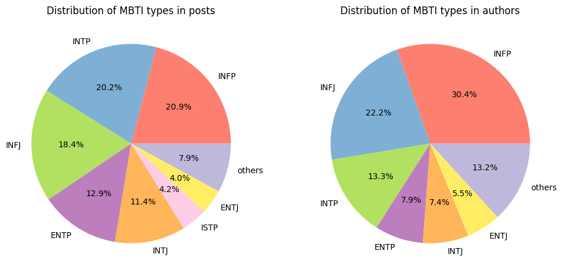
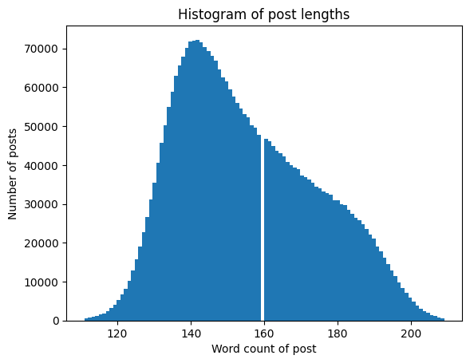

# MBTI Classifier 

This project is aimed to use large language models and online chat message to predict someone's personality. 
We will be using the MBTI indicator as our target. 

## Data Preparation

### Data Curation 

I have created a custom dataset for this project and this dataset is available on [Kaggle](https://www.kaggle.com/datasets/minhaozhang1/reddit-mbti-dataset). 

The raw data was uploaded to [Zenodo](https://zenodo.org/records/1482951) by Dylan Storey. 
It was obtained using Google Big Query from Reddit with users who have self-identified their MBTI type. 
To download the raw data, you can use the following command,

```bash
./setup.sh
```

which will also create some of the temporary directories for the data processing.

I have cleaned the data including 
- lowercasing all the text
- removing all URLs 
- removing posts with non-English characters
- removing Reddit links like `r/abcd` and `u/abcd`
- removing all special characters except for `?` and `!`
- removing posts with less than 20 characters and more than 3000 characters. 

Detailed cleaning steps can be found in [clean_data.py](./preprocessing/clean_data.py)


After cleaning, I found some discrenpencies in the data. 
- some authors have multiple MBTI types. 
- some posts are identical by the same author

I removed all the duplicates described above. 
In addition, there was a user Daenyx who has posted a lot of inapproperiate content.
This resulted him being banned by many moderators with a lot of automated message. 
I removed all the posts by this user.

This is done in [remove_duplicate.py](./preprocessing/remove_duplicate.py)

### Data Summary

The final dataset consist of 13M rows and 3 columns with 11,773 unique authors. 
Each row contains one post with the author name and author's MBTI tag. 
I also provided a dataset with unique authors and their MBTI types.

Some summary statistics of the dataset are as follows:




### Baseline scores

As the nature of online chat, the text length varies a lot. 
A very short text might not contain enough information to predict the MBTI type.
Thus, I concatenated shorter posts from the same author to make a longer post. 
Detailed steps can be found in [combine_short_text.py](./combine_short_text.py)

After that, this could be considered to be the final dataset. 

Based on the final dataset, we can assume a dummy classifier to predict the MBTI type.
It will always predict the most frequent MBTI type. 
These are the baseline metrics for the dataset. 

| Dimension | Accuracy | F1 Score |
|-----------|----------|----------|
|  I & E  | 0.788652 | 0.881840 |
|  N & S  | 0.924903 | 0.960987 |
|  T & F  | 0.535982 | 0.697901 |
|  J & P  | 0.598545 | 0.748862 |


## Pre-Processing 

As the nature of chat messages, the length of each message varies a lot. 
A very short message may not contain enough information to predict someone's personality. 
Thus, I decided to combine shorter messages into longer ones with a minimum length of 700 characters (including spaces) and maximum 1000 characters. 
Detailed steps can be found in [combine_short_text.py](./preprocessing/combine_short_text.py)

Though counting by characters are a effective way to create a balanced dataset, it might introduce some problem when we try to use LLMs' tokenization. 
As the tokenization is roughly based on words, the number of tokens in a sentence might not be the same as the number of characters. 
Thus, I decided to further process the data into a narrower range of word length. 
Detailed steps can be found in [word_count.py](./preprocessing/remove_useless_data.py) and the dataset can be found on [huggingface](https://huggingface.co/datasets/minhaozhang/mbti). 



## Traditional Machine Learning Approach 

### Previous work

There has been efforts to predict someone's personality based on text data. The most extreme example would be the series of quesiton from [16personalities.com](https://www.16personalities.com/) which will classify someone's MBTI type based on the answers. However, using a more natural conversation data, the task becomes more challenging. One such attempt is documented by Ryan et al. (2023) where they used a dataset from Kaggle to predict someone's MBTI type based on the text data. 

They used a traditional machine learning approach with a TF-IDF vectorizer and several classifiers like CatBoost with a technique called SMOTE to balance the data. Their work, though demonstrating the improvement by introducing SMOTE, did not resulted in a good performance. A simple way to tell is that for the binary classification for I/E, their best F1 score is 0.8389. However, based on their I/E distribution of 6676/1999, we can obtain the F1 score of 0.86978 when using a majority classifier. 

### My own attempt 

I followed the same approach as Ryan et al. (2023) with my own cleaned and much larger dataset. I used mostly the same data pre-processing strategy as them, but I used several gradient boosting classifier such as CatBoost, XGBoost, and LightGBM. Though my data distribution is different from theirs, the result did not outperform theirs. My best F1 score is almost the same as the majority classifier within the tolerance of 0.01. The detailed training and evaluation can be found in [train_model.ipynb](./ml/train_model.ipynb)

These unseccessful results might be due to the nature of the MBTI classification or it might be the limitation of the traditional machine learning approach. Thus, I will try to employ the large language models to see if we can improve the performance. 


## Large Language Models

Here, I decided to fine tune the large language models to predict someone's MBTI type. I will be using the recently released [Phi-3](https://azure.microsoft.com/en-us/blog/introducing-phi-3-redefining-whats-possible-with-slms/) model from Microsoft. 


## References

Ryan, Gregorius, Pricillia Katarina, and Derwin Suhartono. 2023. "MBTI Personality Prediction Using Machine Learning and SMOTE for Balancing Data Based on Statement Sentences" Information 14, no. 4: 217. https://doi.org/10.3390/info14040217