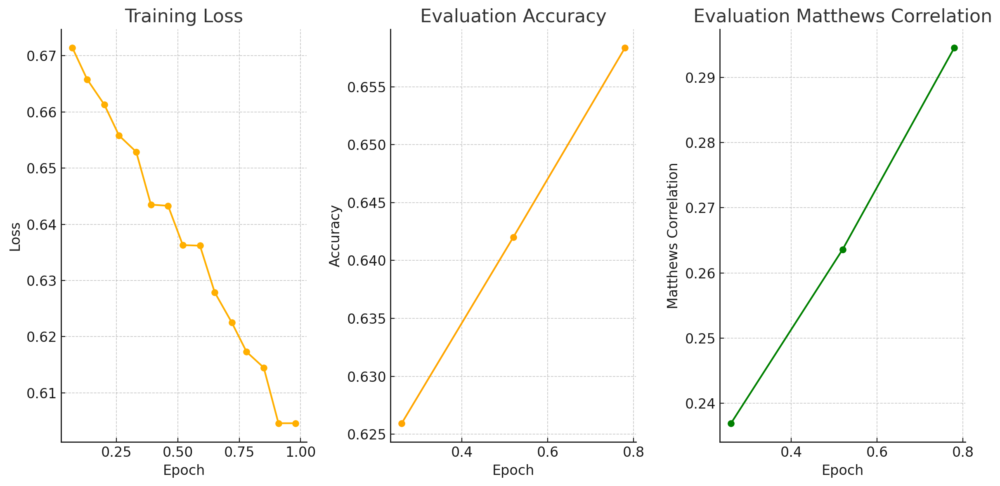

# MBTI分类 - 可行性研究

基于文本数据对某人的MBTI类型进行分类。

There is also an [English version](./README.md) of this document.

- [MBTI分类 - 可行性研究](#mbti分类---可行性研究)
  - [数据准备](#数据准备)
    - [数据整理](#数据整理)
    - [数据摘要](#数据摘要)
    - [预处理](#预处理)
    - [基准分数](#基准分数)
  - [机器学习应用](#机器学习应用)
    - [前期研究概述](#前期研究概述)
    - [我的策略](#我的策略)
  - [大型语言模型的方法](#大型语言模型的方法)
    - [项目起始](#项目起始)
    - [减少 GPU 内存使用量](#减少-gpu-内存使用量)
    - [微调大型语言模型](#微调大型语言模型)
    - [插入系统指引](#插入系统指引)
    - [探索其他MBTI维度](#探索其他mbti维度)
    - [数据重处理](#数据重处理)
  - [处理不平衡数据](#处理不平衡数据)
    - [概览](#概览)
    - [对多数类进行下采样](#对多数类进行下采样)
    - [合成少数类过采样技术（SMOTE）](#合成少数类过采样技术smote)
    - [类别权重平衡](#类别权重平衡)
  - [想法和未来工作](#想法和未来工作)
    - [想法](#想法)
    - [未来工作](#未来工作)
  - [参考文献](#参考文献)


## 数据准备

### 数据整理

在这个项目中，我整理了一个公开可访问的自定义数据集。最初的数据由Dylan Storey上传到[Zenodo](https://zenodo.org/records/1482951)，这些数据是使用Google Big Query从Reddit收集的，包含了自我标识MBTI类型的用户发布的帖子。要下载原始数据，请运行以下命令：

```bash
./setup.sh
```

此命令还会设置数据处理所需的临时目录。

数据经过了彻底的清理，具体步骤包括：
- 将所有文本转换为小写。
- 删除URL。
- 排除包含非英语字符的帖子。
- 删除Reddit特有的链接，如`r/abcd`和`u/abcd`。
- 除`?`和`!`外，删除所有特殊字符。
- 过滤掉少于20个字符或多于3000个字符的帖子。

有关清理过程的详细说明，请参阅[clean_data.py](./preprocessing/clean_data.py)。

在清理过程中，我发现了一些不一致的地方：
- 一些作者与多个MBTI类型相关联。
- 一些帖子是同一作者重复发布的。

为了解决这些问题，我删除了所有重复的帖子，并排除了一个发布不当内容且被多位版主封禁的用户的帖子。为了保持数据的完整性，该用户的所有帖子都被删除了。这些步骤已在[remove_duplicate.py](./preprocessing/remove_duplicate.py)中实现。

### 数据摘要

最终的数据集包含1300万行和3列，代表了11,773名独特的作者。每行包含一个帖子，以及作者的名字和MBTI类型。此外，还提供了一个单独的数据集，其中包含独特的作者及其MBTI类型。

该数据集是MBTI分类的重要资源，可在[Kaggle](https://www.kaggle.com/datasets/minhaozhang1/reddit-mbti-dataset)上下载。

### 预处理

由于聊天信息的性质，其长度差异显著。非常短的消息可能缺乏足够的信息来进行准确的性格预测。为了解决这个问题，我将较短的消息合并，确保文本的最小长度为700个字符（包括空格），最大长度为1000个字符。详细步骤可参见[combine_short_text.py](./preprocessing/combine_short_text.py)。

虽然使用字符数有助于创建一个平衡的数据集，但在使用基于单词分词的LLM（大型语言模型）时可能会带来挑战。为减轻这一问题，我进一步处理了数据，以实现更窄的单词长度范围。步骤详见[evenout_word_length.py](./preprocessing/evenout_word_length.py)，数据集可在[Hugging Face](https://huggingface.co/datasets/minhaozhang/mbti)上获取。

### 基准分数

随着最终数据集的准备，我们可以探索其中MBTI类型的分布。可以使用一个多数分类器来建立基准性能。详细信息请参见[eda.ipynb](./preprocessing/eda.ipynb)。

| 类型 | 准确率  | F1分数  |
| ---- | ------- | ------- |
| E-I  | 0.78858 | 0.88179 |
| N-S  | 0.92603 | 0.96160 |
| F-T  | 0.53863 | 0.70014 |
| J-P  | 0.59189 | 0.74363 |

## 机器学习应用

### 前期研究概述

在基于文本数据预测人格特质方面，人们已进行了广泛的研究与尝试。其中，一个广为人知的例子是[16personalities.com](https://www.16personalities.com/)提供的MBTI问卷，通过收集用户反馈来分配其MBTI类型。然而，在自然对话数据上预测人格特质则更加复杂且富有挑战性。

Ryan等人在2023年的研究中对此进行了深入探索。他们利用Kaggle的数据集，并将传统的机器学习方法应用于文本数据的处理与分类任务，具体包括TF-IDF向量化和CatBoost等分类器的结合使用，以及SMOTE技术以平衡数据集中的类别分布。

尽管在采用SMOTE之后模型表现有所提升，但总体而言，模型的性能仍存在局限性。例如，在二元分类“外倾（E）与内倾（I）”特征时，他们所获得的最佳F1分数为0.8389。然而，基于“外倾”的6676样本和“内倾”的1999个样本分布，一个简单的多数投票策略可以达到的F1分为0.86978，这表明他们的模型在预测精度上并未超越一个非常基础的方法。

### 我的策略

我采用了与Ryan等人（2023）类似的方法，使用了自己清洗过的、规模显著更大的数据集。虽然我也采用了相似的数据预处理策略，并尝试了几种梯度提升分类器，包括CatBoost, XGBoost和LightGBM，但在不同的数据分布下，我的结果同样令人失望，最佳F1分数与多数表决分类器相当。详细的训练和评估过程记录在了[train_model.ipynb](./ml/train_model.ipynb)中。

这些不尽如人意的结果可能是由于MBTI分类的内在复杂性或是传统机器学习技术局限性的体现。因此，我计划探索大型语言模型来提高性能的可能性。

<table>
  <tr>
    <th>Type</th>
    <th>Metric</th>
    <th>Baseline</th>
    <th>XGBoost</th>
    <th>CatBoost</th>
    <th>LightGBM</th>
  </tr>
  <tr>
    <td rowspan="2">E-I</td>
    <td>Accuracy</td>
    <td>0.7886</td>
    <td>0.7891</td>
    <td>0.7889</td>
    <td>0.7890</td>
  </tr>
  <tr>
    <td>F1 Score</td>
    <td>0.8818</td>
    <td>0.8819</td>
    <td>0.8820</td>
    <td>0.8820</td>
  </tr>
  <tr>
    <td rowspan="2">N-S</td>
    <td>Accuracy</td>
    <td>0.9260</td>
    <td>0.9263</td>
    <td>0.9261</td>
    <td>0.9262</td>
  </tr>
  <tr>
    <td>F1 Score</td>
    <td>0.9616</td>
    <td>0.9617</td>
    <td>0.9616</td>
    <td>0.9617</td>
  </tr>
  <tr>
    <td rowspan="2">F-T</td>
    <td>Accuracy</td>
    <td>0.5386</td>
    <td>0.6284</td>
    <td>0.6248</td>
    <td>0.6234</td>
  </tr>
  <tr>
    <td>F1 Score</td>
    <td>0.7001</td>
    <td>0.6794</td>
    <td>0.6794</td>
    <td>0.6781</td>
  </tr>
  <tr>
    <td rowspan="2">J-P</td>
    <td>Accuracy</td>
    <td>0.5919</td>
    <td>0.6162</td>
    <td>0.6116</td>
    <td>0.6116</td>
  </tr>
  <tr>
    <td>F1 Score</td>
    <td>0.7436</td>
    <td>0.3248</td>
    <td>0.2596</td>
    <td>0.2619</td>
  </tr>
</table>

## 大型语言模型的方法

### 项目起始

针对此项目，我选择了使用微软最近推出的[Phi-3](https://azure.microsoft.com/en-us/blog/introducing-phi-3-redefining-whats-possible-with-slms/)模型。尽管Phi-3在近期已通过Azure AI Studio提供定制服务，但为了更灵活地调整模型，我决定采用Hugging Face的[Transformers](https://huggingface.co/transformers/)库。这将使我拥有更广泛的微调选项。

为项目启动阶段指引方向，我遵循了Hugging Face上关于序列分类任务的[详细教程](https://huggingface.co/docs/transformers/en/tasks/sequence_classification)。教程提供了一个坚实的基础框架，并介绍了如何使用Google的BERT模型进行定制。在这一过程中，我发现将BERT替换为更高级的Phi-3模型，虽然技术上更为先进，但也带来了更高的计算要求。即使是最小规模的[Phi-3-mini-4k-instruct](https://huggingface.co/microsoft/Phi-3-mini-4k-instruct)版本，使用个人电脑进行微调也显得有些力不从心。

为了解决这一挑战性问题，我转向了云端服务，并利用配备有A100 GPU的高性能计算资源来执行模型的定制过程。

### 减少 GPU 内存使用量

尽管 A100 GPU 性能很高，但我仍然需要实施策略来管理vRAM的使用量。使用Hugging Face的 [模型内存估算器](https://huggingface.co/spaces/hf-accelerate/model-memory-usage)，我发现该模型与 `Adam` 优化器和 `float32` dtype 相结合，需要 57GB 的峰值 vRAM。除了数据所需的空间外，这将超过 A100 GPU 的 80GB vRAM 容量。因此，我应用了几种策略来优化内存使用量。

这些策略改编自 [Transformers](https://huggingface.co/docs/transformers/perf_train_gpu_one) 教程。

| 方法/工具                 | 实施细节                                   |
| ------------------------- | ------------------------------------------ |
| 批次大小选择              | 是，以减少 vRAM 使用量                     |
| 梯度累积                  | 是，以有效增加批次大小                     |
| 梯度检查点                | 否，因为它会使训练速度降低 20%             |
| 混合精度训练              | 是，使用 `tf32` 来提高训练速度             |
| `torch_empty_cache_steps` | 否，因为它会使训练速度降低 10%             |
| 优化器选择                | 是，使用 `adamw_bnb_8bit` 来减少内存使用量 |
| 数据预加载                | 是，默认情况下                             |
| DeepSpeed Zero            | 否，由于设置环境困难                       |
| `torch.compile`           | 否，由于设置环境困难                       |
| 参数高效微调 (PEFT)       | 否，由于设置环境困难                       |

一个有趣的观察点在于，在尝试通过将数据类型调整至 `bf16` 以进一步压缩内存消耗时，我发现模型在计算过程中产生了 `nan` 的损失输出。我在Hugging Face社区的讨论中发现了一个类似的[问题描述](https://discuss.huggingface.co/t/training-loss-0-0-validation-loss-nan/27950)，尽管涉及的是不同的模型架构。通过查阅该模型的具体配置文件 [config.json](https://huggingface.co/microsoft/Phi-3-mini-4k-instruct/blob/main/config.json#L31)，我们发现它确实是在 `bf16` 数据类型下进行训练的，但这一设置并未解决我遇到的问题。目前，我尚未找到有效的解决方案来应对这一现象。我热烈欢迎任何有关此问题可能原因或如何解决的见解和建议。

### 微调大型语言模型

基于情绪分析指南调整代码时，为了处理MBTI分类任务（通常可以分解为四个二元子任务），我采取了细分策略而非直接处理单一的16类任务。**更多关于这一决策的详细信息，请查看 [此处](#future-work)**。我首先从对称型(J-P)类别开始，因其数据分布相对均衡但存在轻微偏差而选择。使用训练集的1%子集进行微调时，模型似乎在初步阶段表现出有效的学习能力。


有趣的是，经过微调后，该模型的准确性超越了简单多数分类器，但这或许是因为数据随机性的结果。通过优化代码（纠正未使用`tf32`的问题）并将数据集规模扩展至训练集的10%之后，得到的结果却不太乐观。


尽管如此，经过微调后的模型在识别对称型类别方面表现良好，但未能显著超越简单多数分类器。这一结果表明，模型主要学会的是预测最常见的类别。意识到这个局限性后，我暂停了训练过程以进行深入分析和问题诊断。

### 插入系统指引

此时我认识到，MBTI 类型识别对于大型语言模型而言可能较情绪分析等简单任务更具挑战性。识别 MBTI 的模式要求更深入的理解能力。为帮助模型聚焦于任务，我在每个输入文本前添加了一个半自动的提示：

```
您是一位专门研究MBTI性格分类的专业人士。根据以下段落的内容判断作者的性格类型。
仅预测 J-P 类型，其中J代表判断，P代表感知；将J对应于0, P对应于1。
专注于性格分析而非数据模式，以下是文本：
```

这个提示的目的是明确指示模型应该集中注意力于性格识别上，并避免过于关注数据分布。然而，尽管我进行了这样的调整，结果并未展现出任何性能提升。

### 探索其他MBTI维度

鉴于在J-P分类中的挑战性发现，我转向了探索其他MBTI维度以求更全面的理解和改进。我首先聚焦于感觉-思考（F-T）维度，因其被认为较为均衡而选取。初始阶段，我没有为输入文本提供系统提示。

我使用了训练数据的5%子集进行微调工作。


这次尝试取得了更高的准确性分数，但F1分数相对较低。在迭代至约8000步时，准确度和F1评分开始显著下降，这恰好与新时代的起始相呼应，暗示模型正在对同一数据集进行重复学习。当推进到9000步时，观察到训练损失已明显降低，而验证损失依然居高不下，这表明存在过度拟合现象。此迹象提示我们应限制训练周期的长度，以防模型在相同的数据上反复学习导致过拟合。

尽管尝试了所有MBTI维度的训练，但结果并未显示出显著改善，这可能意味着当前策略或模型配置需要进一步优化与调整。

### 数据重处理

最初阶段，我简化了文本处理步骤：移除除了“？”和“！”之外的所有标点符号并将所有内容转换为小写形式，以便于对 word2vec 模型的训练。同时，为了适应 word2vec 的需求，每个帖子被限制在大约 200 字以内。然而，这样的长度可能不足以让大型语言模型（LLM）捕捉到细微的情感模式。我决定增加文本处理步骤，将每篇帖子扩展至约 400 字，尽管这一改动导致样本总数有所减少。

数据的重新处理遵循了详细的说明，见 [re_process_data.ipynb](./preprocessing/re_process_data.ipynb)，并在调整后再次对模型进行了微调。尽管采取了一系列改进措施，该模型仍然未能在分类性能上超越简单的多数分类器。这一结果暗示可能存在其他未解决的关键问题或优化空间，可能需要从数据预处理、模型架构选择还是训练策略等多个方面进一步探索与优化。

## 处理不平衡数据

### 概览

不平衡数据是分类任务中常见的挑战，即使是强大的模型如大型语言模型（LLM）也难以应对这个问题。在处理不平衡的数据集时，模型往往默认预测多数类别的结果，导致对少数类别的性能不佳。为了解决这一问题，可以应用以下几种技术：

- **过采样少数类别/下采样多数类别**
- **SMOTE（合成少数类过采样技术）**
- **类别权重平衡**

### 对多数类进行下采样

正如前文中所提及的，当模型再次接触到训练数据时，它出现了过拟合的迹象。鉴于此情况，如果对少数类进行过采样可能加剧过拟合问题，所以我选择了对多数类进行下采样。在我有大量数据可用的情况下，我可以减少多数类的数量而不影响整体数据量。我的方法是随机从多数类中选取一个子集，使其大小与少数类相匹配。

我首先使用了J-P维度，这是一个稍微不平衡但并不过于严重的领域。在从训练数据中创建了一个额外的验证集后，我对多数类进行了下采样。然而，这一策略并没有带来任何模型性能的改善。尽管训练损失有所变化，反映了数据分布的变化，准确率和F1分数仍然与一般分类器的表现相似。这表明我的基本下采样方法可能并不有效，或者MBTI分类对于这种方法存在固有的挑战。

### 合成少数类过采样技术（SMOTE）

`imbalanced-learn`库提供了SMOTE工具，用于为少数类别生成合成样本。在Hugging Face社区中，有讨论提及如何结合自定义数据加载器将SMOTE应用于文本数据集的问题（[相关链接](https://discuss.huggingface.co/t/how-to-apply-smote-to-a-dataset/27876)）。然而，基于深入的研究和分析，我发现SMOTE可能不适合生成适合于文本数据的合成样本。尽管Ryan等人在他们的研究中采用了SMOTE并观察到了性能改善（参照：Ryan et al. (2023)），但他们的模型仍然未能超越一般分类器的表现。这促使我进一步探索了处理不平衡数据时，除了SMOTE之外还有哪些更为适合的方法和策略。

在这过程中，我意识到不同方法对于文本类别平衡问题的适应性和有效性可能有所不同，需要根据具体的数据集特性和任务需求来选择最适合的技术。因此，在寻找更有效处理文本数据不平衡问题的解决方案的同时，我还在考虑其他先进的数据增强技术、调整模型参数、以及集成学习等策略，以提高整体性能和分类准确性。

### 类别权重平衡

我也尝试了类别权重调节方法，这是根据Hugging Face社区中某个[论坛帖子](https://discuss.huggingface.co/t/how-can-i-use-class-weights-when-training/1067)的建议。这种方法通过将与少数类相关的损失调整为按照多数类别和少数类别之间的比例缩放来实现。对于J-P维度，其划分比率为60:40，我相应地调整了类别权重。

在利用训练数据的10%时，模型开始展示出学习迹象：


此阶段的准确率超过了通常的分类器水平，这是一个积极的信号。接下来，在额外获得18%的数据后（并使用1.8%作为评估集），我们继续进行训练。根据日志数据，最终结果如下：

```text
{'loss': 0.6714, 'grad_norm': 5.364511013031006, 'learning_rate': 1.8698086186694442e-05, 'epoch': 0.07}
{'loss': 0.6658, 'grad_norm': 22.42624855041504, 'learning_rate': 1.7396172373388882e-05, 'epoch': 0.13}
{'loss': 0.6613, 'grad_norm': 14.555525779724121, 'learning_rate': 1.6094258560083326e-05, 'epoch': 0.2}
{'loss': 0.6558, 'grad_norm': 24.612394332885742, 'learning_rate': 1.4792344746777764e-05, 'epoch': 0.26}
{'eval_loss': 0.6462374329566956, 'eval_accuracy': 0.6259446950612221, 'eval_f1': 0.6740354056848205, 'eval_matthews_correlation': 0.2369166100794352, 'eval_runtime': 1751.6386, 'eval_samples_per_second': 38.978, 'eval_steps_per_second': 9.745, 'epoch': 0.26}
{'loss': 0.6529, 'grad_norm': 9.507387161254883, 'learning_rate': 1.3490430933472205e-05, 'epoch': 0.33}
{'loss': 0.6435, 'grad_norm': 19.002174377441406, 'learning_rate': 1.2188517120166645e-05, 'epoch': 0.39}
{'loss': 0.6433, 'grad_norm': 1.6572412252426147, 'learning_rate': 1.0886603306861087e-05, 'epoch': 0.46}
{'loss': 0.6363, 'grad_norm': 13.904766082763672, 'learning_rate': 9.584689493555527e-06, 'epoch': 0.52}
{'eval_loss': 0.6292107105255127, 'eval_accuracy': 0.6420118343195266, 'eval_f1': 0.6934557403366193, 'eval_matthews_correlation': 0.26360932965460177, 'eval_runtime': 1750.7546, 'eval_samples_per_second': 38.998, 'eval_steps_per_second': 9.75, 'epoch': 0.52}
{'loss': 0.6362, 'grad_norm': 16.839187622070312, 'learning_rate': 8.282775680249967e-06, 'epoch': 0.59}
{'loss': 0.6279, 'grad_norm': 9.333328247070312, 'learning_rate': 6.980861866944409e-06, 'epoch': 0.65}
{'loss': 0.6225, 'grad_norm': 11.680238723754883, 'learning_rate': 5.67894805363885e-06, 'epoch': 0.72}
{'eval_loss': 0.6130561232566833, 'eval_accuracy': 0.6583572558439276, 'eval_f1': 0.7098467509204897, 'eval_matthews_correlation': 0.29455154970144476, 'eval_runtime': 1768.5199, 'eval_samples_per_second': 38.606, 'eval_steps_per_second': 9.652, 'epoch': 0.78}
{'loss': 0.6173, 'grad_norm': 5.525467395782471, 'learning_rate': 3.075120427027731e-06, 'epoch': 0.85}
{'loss': 0.6145, 'grad_norm': 3.068687915802002, 'learning_rate': 1.7732066137221718e-06, 'epoch': 0.91}
{'loss': 0.6046, 'grad_norm': 4.138741970062256, 'learning_rate': 4.7129280041661244e-07, 'epoch': 0.98}
```

我们可以通过以下图表可视化训练过程：



我们可以看到评估准确率呈现出稳定的上升趋势，并最终达到了0.658的高值。这一数值远高于基准线水平，表明该方法是有效的。需要指出的是，在这个过程中，每个"epoch"并不代表完整训练数据，而是只使用了其中的一部分。总共利用了28%可用的训练数据来训练模型。

由于计算资源和项目预算的限制，我不得不在这一点上结束训练，这使得此次更多地成为一个可行性研究。然而，如果你对继续训练感兴趣，该模型已经在Hugging Face平台的[链接](https://huggingface.co/minhaozhang/Phi-3-mini-4k-instruct-mbti-JP)上提供。

## 想法和未来工作

### 想法

基于文本数据的 MBTI 分类面临着独特的挑战，使其有别于情绪分析等更简单的任务。与情绪不同，情绪通常在文本中有明确的指标（例如，特定的关键字或短语），而 MBTI 分类需要更深入地了解上下文、语音模式和说话者的意图。这种微妙的复杂性使得即使是先进的模型也难以准确预测性格类型。这项任务需要对语言和行为有细致入微的理解，而大型语言模型 (LLM) 可能仍难以完全掌握。

### 未来工作
该项目有几个方面可以进一步改进：

1. **假设 MBTI 维度之间相互独立**：
- 在当前方法中，每个 MBTI 维度都被视为一个单独的二元分类任务，假设维度之间相互独立。然而，这可能并不反映现实，因为不同维度之间可能存在相关性，如果加以利用，可以提高分类准确性。未来的工作可以探索多标签分类或其他考虑 MBTI 维度之间相互关系的方法。

2. **利用更强大的 LLM**：
- 虽然 Phi-3 是一个有前途的模型，拥有 38 亿个参数和 4k 个 token 上下文，但更大的先进模型（如 Llama3.1，拥有多达 4050 亿个参数和 128k 个 token 上下文）可能更适合这项任务。这些更大的模型可以从文本中捕获更细微的信息，从而可能提高性能。然而，由于计算限制，对如此大的模型进行微调超出了本项目的范围。

3. **采用更先进的微调策略**：
- 当前的微调方法利用了 Hugging Face Transformers 库中的“AutoModelForSequenceClassification”，这是一个坚实的基础。但是，使用 PyTorch 开发自定义训练循环可以提供更大的灵活性，允许进行更专门针对 MBTI 分类挑战的微调。

4. **改进数据预处理技术**：
- 该项目中使用的数据预处理策略有效，但可能不是此特定任务的最佳选择。虽然应用了常见的 NLP 技术，但可以开发更复杂的预处理方法。结合心理学和语言学的见解可以更细致地处理语言结构和语境元素，更好地支持模型捕捉性格类型的细微差别。
  
## 参考文献

Ryan, Gregorius, Pricillia Katarina, and Derwin Suhartono. 2023. "MBTI Personality Prediction Using Machine Learning and SMOTE for Balancing Data Based on Statement Sentences" Information 14, no. 4: 217. https://doi.org/10.3390/info14040217