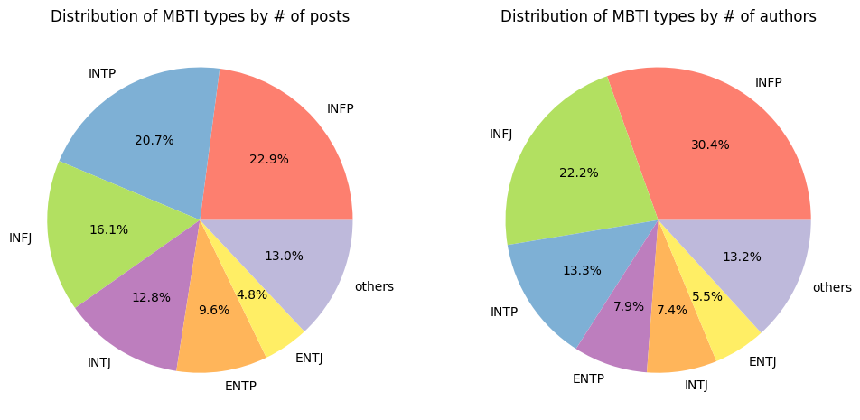
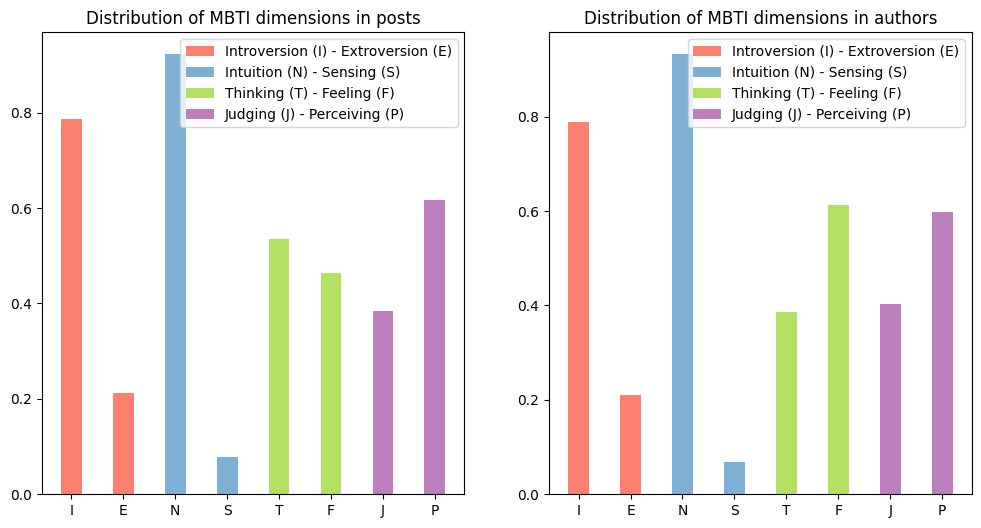
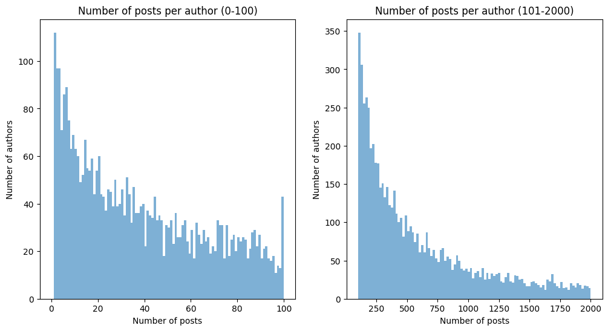

# Data Summary

## Data Creation

I have created a custom dataset for this project and this dataset is available on Kaggle. 

The raw data was uploaded to [Zenodo](https://zenodo.org/records/1482951) by Dylan Storey. It was obtained using Google Big Query from Reddit with users who have self-identified their MBTI type. 

I have cleaned the data including 
- lowercasing all the text
- removing all URLs 
- removing posts with non-English characters
- removing Reddit links like `r/abcd` and `u/abcd`
- removing all special characters except for `?` and `!`
- removing posts with less than 20 characters and more than 3000 characters. 

Detailed cleaning steps can be found in [clean_data.py](./clean_data.py)

After cleaning, I found some discrenpencies in the data. Some users have multiple MBTI types. I have removed these users from the dataset as well. This is done in [unique_author.py](./unique_author.py)

## Data Summary

The final dataset consist of 19.6M rows and 3 columns with 11,774 unique authors. Each row contains one post with the author name and author's MBTI tag. I also provided a dataset with unique authors and their MBTI types.

Some summary statistics of the dataset are as follows:

