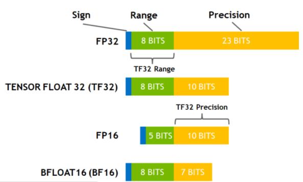
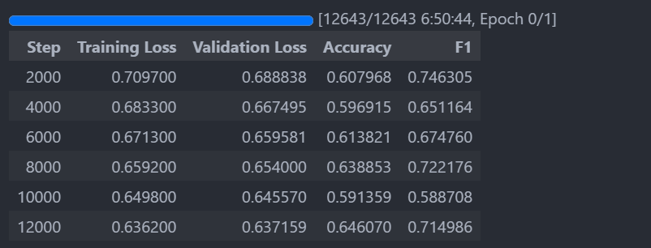

# How to fine tune LLMs to classify MBTI based on text data

## Introduction

Text classification is a common task in Natural Language Processing (NLP). 
It is the process of assigning a label to a piece of text based on its content. 
For example, classifying a movie review as positive or negative, or classifying a news article as sports, politics, or entertainment. 
Prior to the advent of Large Language Models (LLMs), text classification was done using traditional machine learning with a lot of feature engineering. 
Word embeddings like Word2Vec, GloVe, and FastText were used to convert text into numerical vectors.
Then, these vectors were fed into a machine learning model like Logistic Regression, Support Vector Machines, or Random Forests to classify the text.
This process can be slow and requires a lot of manual work to get good results.

With the power of LLMs, certain text classification tasks becomes possible to solve with a few lines of code. 
In this tutorial, we will use the Hugging Face Transformers library to train a text classification model to classify someone's **MBTI** based on their text data. 

## What is MBTI?

The Myers-Briggs Type Indicator (MBTI) is a personality test that categorizes people into 16 different personality types.
Each personality type is a combination of four letters, each representing a different aspect of a person's personality.

The four aspects are:
1. **E**xtraversion (E) vs **I**ntroversion (I)
2. **S**ensing (S) vs i**N**tuition (N)
3. **T**hinking (T) vs **F**eeling (F)
4. **J**udging (J) vs **P**erceiving (P)

## Dataset

I will be using a MBTI dataset curated by myself.
You can find more information about it [here]([INVALID_LINK](https://github.com/Minhao-Zhang/MBTI-Classification)). 

In short, it is a dataset of 3M rows with the following columns:
- author: the author of the text
- body: the text data
- mbti: the MBTI of the author
- E-I: the Extraversion (E) vs Introversion (I) aspect of the MBTI
- N-S: the iNtuition (N) vs Sensing (S) aspect of the MBTI
- F-T: the Feeling (F) vs Thinking (T) aspect of the MBTI
- J-P: the Judging (J) vs Perceiving (P) aspect of the MBTI

## Setup environment

Though it is possible to run many LLMs on CPUs now, fine tuning them is still infeasible without a GPU. 
Thus, a GPU with more than 40GB of vRAM is necessary for this tutorial. 
I suggest using a cloud computing service that could provide you an Ubuntu VM with CUDA and cuDNN installed. 
Otherwise, you should first make sure you have proper versions of CUDA and cuDNN installed on your machine. 
You can find more information about the installation process [here](https://docs.nvidia.com/cuda/cuda-installation-guide-linux/).

With everything ready, let's start by creating a new Python environment and installing the necessary libraries.

```bash
conda create -n mbti-tuning python=3.12.4
conda activate mbti-tuning
```

Then, we will be needing the following libraries:

```bash
pip install numpy scikit-learn python-dotenv datasets transformers evaluate accelerate pytorch
```

## Load the dataset 

To save the model, we will need to create an account on the Hugging Face website and get an access key. 
We can save the access key in a `.env` file in the root directory of your project.

```python
from huggingface_hub import login
from dotenv import load_dotenv
import os
load_dotenv()
login(token=os.getenv("HF_HUB_TOKEN"))
```

Then, you can load the dataset using the `datasets` library.
The following code will either download the dataset from Huggingface or load it from cache. 

```python
from datasets import load_dataset

mbti_data = load_dataset("minhaozhang/mbti", split='train')
```

To ensure we have a good train-validation split, we will be using stratified sampling.
Thus, we need to encode the column first. 
    
```python
mbti_data = mbti_data.class_encode_column("mbti")
mbti_data = mbti_data.class_encode_column("E-I")
mbti_data = mbti_data.class_encode_column("N-S")
mbti_data = mbti_data.class_encode_column("F-T")
mbti_data = mbti_data.class_encode_column("J-P")
```

Since the training split contains about 2.3M rows of data, training on all of them will take too long. Thus, we will be using only 10% of the data for training and 20% of that data for validation.

```python
mbti_data = mbti_data.train_test_split(test_size=0.1, stratify_by_column="mbti", seed=0)
mbti_data = mbti_data["test"] # throw away 90% of the data
mbti_data = mbti_data.train_test_split(test_size=0.2, stratify_by_column="mbti", seed=1)
```

## Define the model 

Unlike the tutorial on Huggingface which uses BERT, a relatively older model, I will be using Phi-3 by Microsoft, which is released in 2024. 

```python
MODEL = "microsoft/Phi-3-mini-4k-instruct" 
TRAINED_MODEL = "Phi-3-mini-4k-instruct-mbti"
```

Then, we can define the model and the tokenizer.

```python
from transformers import AutoTokenizer 

tokenizer = AutoTokenizer.from_pretrained(MODEL)

def preprocess_function(data):
    return tokenizer(data["body"], truncation=True)

tokenized_mbti_data = mbti_data.map(preprocess_function, batched=True)
del mbti_data # save RAM
```

To simplified the problem, I will only classify the J-P aspect of MBTI as it is somewhat imbalance but not skewed too much. In this dataset, the J-P aspect has a 60-40 split.Hence, I will remove all otherr columns.

```python
tokenized_mbti_data = tokenized_mbti_data.remove_columns(['author', 'mbti', 'F-T', "E-I", 'N-S'])
tokenized_mbti_data = tokenized_mbti_data.rename_column('J-P', "label")
```

To simplify batching data and improve efficiency by padding tokens on the fly, we will use a `DataCollator`. 

```python
from transformers import DataCollatorWithPadding

data_collator = DataCollatorWithPadding(tokenizer=tokenizer)
```

To evaluate our model, the `evaluate` package provided a lot of out-of-box metrics we can use. 

```python
import evaluate

# use 3 different metrics to evaluate the model
accuracy = evaluate.load("accuracy")
f1 = evaluate.load("f1")
matthews_correlation = evaluate.load("matthews_correlation")

import numpy as np

def compute_metrics(eval_pred):
    predictions, labels = eval_pred
    predictions = np.argmax(predictions, axis=1)
    accuracy_result = accuracy.compute(predictions=predictions, references=labels)
    f1_result = f1.compute(predictions=predictions, references=labels)
    matthews_correlation_result = matthews_correlation.compute(predictions=predictions, references=labels)
    return {**accuracy_result, **f1_result, **matthews_correlation_result}
```

We also need a mapping between labels and ids in order for the model to perform loss calculation in training. You need to make sure they are correct as it will lead to NaN is loss computation resulting the model laerning nothing at all. 

```python
id2label = {0: "J", 1: "P"}
label2id = {"J": 0, "P": 1}
```

We can now define the model with `AutoModel` from `transformers`. 

```python
from transformers import AutoModelForSequenceClassification, TrainingArguments, Trainer

model = AutoModelForSequenceClassification.from_pretrained(
    MODEL, num_labels=2, id2label=id2label, label2id=label2id
)
```

## Fine Tuning LLMs 

In order to use provided `AutoModelForSequenceClassification` class, we need to define the training arguments. 

```python 
import torch
torch.backends.cuda.matmul.allow_tf32 = True
torch.backends.cudnn.allow_tf32 = True

training_args = TrainingArguments(
    output_dir=TRAINED_MODEL,
    learning_rate=2e-5,
    per_device_train_batch_size=4, # modify based on your vRAM
    per_device_eval_batch_size=4, # modify based on your vRAM
    num_train_epochs=1, 
    weight_decay=0.01,
    eval_strategy="steps", # modify based on your data size
    save_strategy="steps", # modify based on your data size
    logging_steps=1000, # modify based on your data size
    eval_steps=1000, # modify based on your data size
    save_steps=1000, # modify based on your data size
    load_best_model_at_end=True,
    push_to_hub=True,
    optim="adamw_bnb_8bit",
    eval_accumulation_steps=2, # modify based on your vRAM
    gradient_accumulation_steps=2, # modify based on your vRAM
    tf32=True,
)
```

In this training argument, several methods are used to speed up the training process and reduce the memory usage. 
- batch size is set to 4 to reduce the memory usage.
- `optim="adamw_bnb_8bit"`: use AdamW with ByteNetBlock 8-bit quantization. This will reduce the vRAM usage by 4 times. You can see more information about this [here](https://huggingface.co/docs/transformers/perf_train_gpu_one#optimizer-choice). 
- `gradient_accumulation_steps=2` and `eval_accumulation_steps=2` to effectively increase the batch size to 8. 
- `tf32=True` to use TensorFloat32 for training.



With this visualization, you can see that using tf32 will sacrifice precision for less memory usage. TF32 takes 19 bits instead of 32 bits for each float, thus reducing the memory usage by 40%. According to [NVIDIA](https://blogs.nvidia.com/blog/tensorfloat-32-precision-format/), research has shown that model trained with tf32 and models trained with fp32 perform very similarly. 

> You can see that we did not use bf16 to fine tune the model. According to the model configuration, Phi3 model is actualy trained with bf16. However, due to some unkown reason, the loss will be NaN if we use bf16 in the fine tuning process. 


Now, we can define the trainer and start training the model. 

```python
from torch import nn
from transformers import Trainer

class CustomTrainer(Trainer):
    def compute_loss(self, model, inputs, return_outputs=False):
        labels = inputs.get("labels")
        # forward pass
        outputs = model(**inputs)
        logits = outputs.get('logits')
        # compute custom loss
        loss_fct = nn.CrossEntropyLoss(weight=torch.tensor([0.6, 0.4]).to('cuda'))
        loss = loss_fct(logits.view(-1, self.model.config.num_labels), labels.view(-1))
        return (loss, outputs) if return_outputs else loss

trainer = CustomTrainer(
    model=model,
    args=training_args,
    train_dataset=tokenized_mbti_data["train"],
    eval_dataset=tokenized_mbti_data["test"],
    tokenizer=tokenizer,
    data_collator=data_collator,
    compute_metrics=compute_metrics,
)
```

Here, we wrote a custom trainer with a special loss function. As we discussed before, our data is not balanced with roughly a 60-40 split. Thus, we use a weight balancing method in order to prevent the model turns into a majority calssifier. 

Finnaly, we can actually train the model. 

```python
trainer.train()
trainer.evaluate()
trainer.save_model(TRAINED_MODEL)
trainer.push_to_hub()
```

These code will train the model and push the trained model to your Huggingface repository. 

## Results 

If you put everything above into a jupyter notebook, you will see something similar to below. 



With the training loss and validation loss steadily going down, the accuracy is growing up. In the end, the model will be able to classify the J-P aspect of MBTI with a accuracy of 0.65. Though this result is not particularly good, considering we only used 10% of the data and a small model, this is a decent result. You can further improve the model by using more data, a larger model, and more training epochs.

If you want to see the full code, you can find it [here](https://github.com/Minhao-Zhang/MBTI-Classification/)